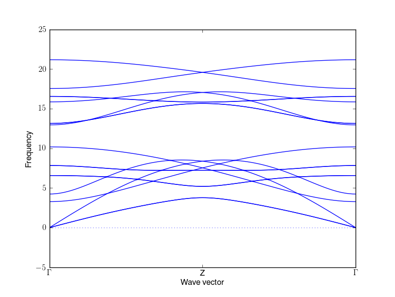
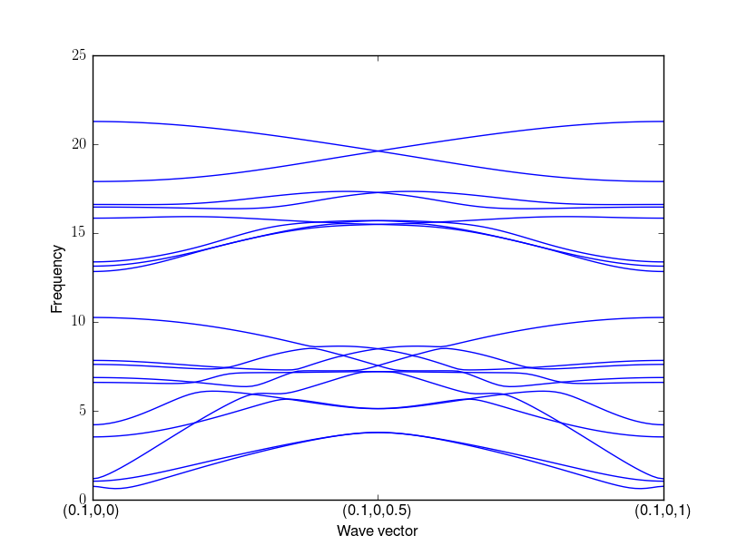

.. _group_velocity:

Group velocity
====================

Method
------------

Phonopy calculates group velocity of phonon using finite different
approach as follows:

.. math::

   \mathbf{v}_\mathrm{g}(\mathbf{q}\nu) = & \nabla_\mathbf{q} \omega(\mathbf{q}\nu) \\
   =&\frac{\partial\omega(\mathbf{q}\nu)}{\partial \mathbf{q}} \\
   =&\frac{1}{2\omega(\mathbf{q}\nu)}\frac{\partial[\omega(\mathbf{q}\nu)]^2}{\partial
   \mathbf{q}} \\
   =&\frac{1}{2\omega(\mathbf{q}\nu)}\left<\mathbf{e}(\mathbf{q}\nu)\biggl|
   \frac{\partial D(\mathbf{q})} {\partial
   \mathbf{q}}\biggl|\mathbf{e}(\mathbf{q}\nu)\right> \\
   \simeq & \frac{1}{2\omega(\mathbf{q}\nu)}
   \left<\mathbf{e}(\mathbf{q}\nu)\biggl|
   \frac{\Delta D(\mathbf{q})}
   {\Delta \mathbf{q}}\biggl|\mathbf{e}(\mathbf{q}\nu)\right>,

where the meanings of the variables are found at :ref:`formulations`.

Parameter 
------------------

:math:`\Delta\mathbf{q} = (\Delta q_x, \Delta q_y, \Delta q_z)` is
described in Cartesian coordinated in reciprocal space. In the
implementation, central difference is employed, and :math:`+\Delta
q_\alpha` and :math:`-\Delta q_\alpha` are taken to calculate group
velocity, where :math:`\alpha` is the Cartesian index in reciprocal
space. :math:`\Delta q_\alpha` is specified in the unit of reciprocal
space distance (:math:`\mathrm{\AA}^{-1}` for the default case) by
``--gv_delta_q`` option or ``GV_DELTA_Q`` tag.

Technical limitaton
---------------------

In some case, the group velocity is incorrectly calculated. This is
shown taking example of SnO2 rutile structure.

The space group type is P4_2/mnm (136). This is a non-symmorphic space
group and a screw axis of c exists. Usually slope of phonon band
normal to the Brillouin zone boundary becomes zero, but there are some
positive and negative slopes are found at the Brilloun zone boundary
due to the screw symmetry operation. This can be watched by

::

   % phonopy --dim="2 2 2" --band="0 0 0  0 0 1" -p

where Z(0, 0, 1/2). The band structure is shown below (drawn with
special point symbols).

|i0|

Non-zero slope indicates non-zero group velocity. But phonopy is
usually not able to calculate these group velocity correctly. Because
phonon mode is degenerate at this point and the numerically calculated
eigenvector for the degenerate mode is determined almost randomly with
respect to very little numerical noise, and this eigenvecor doesn't
have ability to represent group velocity (or vector variable). An
example of wrongly calculated group velocity is shown as follows. We
obtain the group velocity by

::

   % phonopy --dim="2 2 2" --band="0 0 0  0 0 1" --gv

In band.yaml file, group velocity of band #7 and #8 at q=(0, 0, 0.5)
are shown as

::

  - # 7
    frequency:    7.5390344506
    group_velocity: [    -0.0000000,     0.0000000,   -16.7130708 ]
  - # 8
    frequency:    7.5390344506
    group_velocity: [     0.0000000,    -0.0000000,    16.7130708 ]

But at the neighboring q-point of q=(0, 0, 0.52),

::

  - # 7
    frequency:    7.3428399771
    group_velocity: [    -0.0000000,     0.0000000,   -32.1764347 ]
  - # 8
    frequency:    7.7304844141
    group_velocity: [     0.0000000,    -0.0000000,    30.6385174 ]

This doesn't mean the group velocity suddenly changes between these
neighboring q-points. The group velocity at q=(0, 0, 0.52) is
correctly calcualted but not at q=(0, 0, 0.5). Therefore the group
velocity close to q=(0, 0, 0.5) should be used instead of the value at
q=(0, 0, 0.5) if we can accept this approximation.

Similarly this happens at non-special points, too. The following band
structure is drawn along the path :math:`(0.1, 0, 0) \rightarrow (0.1,
0, 0.5) \rightarrow (0.1, 0, 1)`. 

|i1|

This path crosses the Brillouin zone boundary perpendicularly, too.
Similarly the group velocities are incorrectly calculated at q=(0.1,
0, 0.5) as

::

  - # 7
    frequency:    7.5297693984
    group_velocity: [    -1.3426747,    -2.7158889,    -3.4458117 ]
  - # 8
    frequency:    7.5297693984
    group_velocity: [    -1.3426747,     2.7158889,     3.4458117 ]

The group velocity q-point of q=(0.1, 0, 0.52) is correctly calculated
as

::

  - # 7
    frequency:    7.3531028518
    group_velocity: [    -0.2296623,    -0.0000000,   -25.3990775 ]
  - # 8
    frequency:    7.7173472223
    group_velocity: [    -1.6375441,    -0.0000000,    30.4311514 ]

