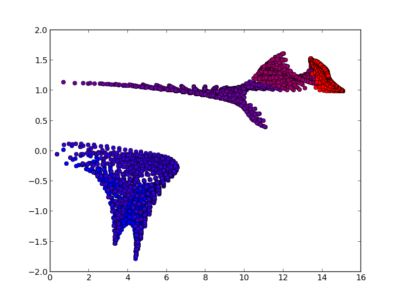

.. _phonopy_gruneisen:

Calculation of mode Grüneisen parameters
========================================

How to run
-----------

It is necessary to run three phonon calculations. One is calculated at
the equilibrium volume and the remaining two are calculated at the
slightly larger volume and smaller volume than the equilibrium
volume. The unitcells at these volumes have to be fully relaxed under 
the constraint of each volume.

Let files named ``POSCAR-unitcell``, ``FORCE_SETS`` (or ``FORCE_CONSTANTS``
with ``--readfc`` option),
and optionally ``BORN`` stored in three different directories
named, e.g., ``equiv``, ``plus``, and ``minus``.

The calculated results are written into the file ``gruneisen.yaml``.

In the example directory, an example of silicon (``Si-gruneisen``) is
prepared. A calculation along paths in reciprocal space can be made by

::

   % gruneisen orig plus minus --dim="2 2 2" --pa="0 1/2 1/2 1/2 0 1/2 1/2 1/2 0" --band="1/2 1/4 3/4 0 0 0 1/2 1/2 1/2 1/2 0.0 1/2" -p -c POSCAR-unitcell

.. |i0| image:: Si-gruneisen-band.png
        :scale: 50

|i0|

In this calculation, neighboring **q**-points in each band segment are
connected considering their phonon symmetry to treat band crossing
correctly. Therefore the phonon frequencies may not be ordered in
``gruneisen.yaml``. In the plot (``-p`` option), the colors of phonon
bands correspond to those of mode Grüneinen parameters.

A calculation on a reciprocal mesh is made by

::

   % gruneisen orig plus minus --dim="2 2 2"  --pa="0 1/2 1/2 1/2 0 1/2 1/2 1/2 0" --mesh="20 20 20" -p -c POSCAR-unitcell --color="RB"

|i1|

In the plot (``-p`` option), the colors of mode Grüneinen parameters
are set for band indices with ascending order of phonon frequencies.

Mode Grüneinen parameter may diverge around :math:`\Gamma`-point. In
the above example for band paths, mode Grüneinen parameters are
calculated at :math:`\Gamma`-point, but ``gruneisen`` script avoids
showing the values on the plot. Instead the values at the neighboring
**q**-points of :math:`\Gamma`-point are used for the plot.

.. _gruneisen_calculators:

Abinit, Pwscf, and Wien2k interfaces
-------------------------------------

``--abinit``, ``--pwscf``, or ``--wien2k`` options can be specified
for corresponding calculators and the crystal structure file format
should be different from that of the VASP format. An Abinit example is
as follows::

   % gruneisen orig plus minus --abinit --dim="2 2 2" --pa="0 1/2 1/2 1/2 0 1/2 1/2 1/2 0" --band="1/2 1/4 3/4 0 0 0 1/2 1/2 1/2 1/2 0.0 1/2" -p -c Si.in

.. _gruneisen_command_options:

Command options
----------------

If one of ``--abinit``, ``--pwscf``, or ``--wien2k`` options is
specified, the interface mode is changed to it. The unit conversion
factor to THz is appropriately selected and its crystal structure file
format is accepted. If none of them is specified, as the VASP
interface mode is invoked as the default interface.

The following command options can be used for all interface
modes. They work similarly to those for ``phonopy`` script.

* ``--dim``
* ``--mp``, ``--mesh``
* ``--band``
* ``--pa``, ``--primitive_axis``
* ``--readfc``
* ``--band_points``
* ``--nac``
* ``--factor``
* ``--nomeshsym``
* ``-p``
* ``-c``
* ``-s``, ``--save``
* ``-o``

The ``--color`` option (``RB``, ``RG``, ``RGB``) is used to gradually
change the marker colors with respect to band indices. For the
mesh-sampling plot, a few more options to control matplotlib
parameters are prepared.

Method to calculate mode Grüneisen parameters
---------------------------------------------

Mode Grüneisen parameter :math:`\gamma(\mathbf{q}\nu)` at the wave
vector :math:`\mathbf{q}` and band index :math:`\nu` is given by

.. math::

   \gamma(\mathbf{q}\nu) =& -\frac{V}{\omega(\mathbf{q}\nu)}\frac{\partial
   \omega(\mathbf{q}\nu)}{\partial V}\\
   =&-\frac{V}{2[\omega(\mathbf{q}\nu)]^2}\left<\mathbf{e}(\mathbf{q}\nu)\biggl|
   \frac{\partial D(\mathbf{q})}
   {\partial V}\biggl|\mathbf{e}(\mathbf{q}\nu)\right>,

where :math:`V` is the volume, :math:`\omega(\mathbf{q}\nu)` is the
phonon frequency, :math:`D(\mathbf{q})` is the dynamical matrix,
and :math:`\mathbf{e}(\mathbf{q}\nu)` is the eigenvector. This is
approximated by the finite difference method:

.. math::

   \gamma(\mathbf{q}\nu) \simeq -\frac{V}{2[\omega(\mathbf{q}\nu)]^2}
   \left<\mathbf{e}(\mathbf{q}\nu)\biggl|
   \frac{\Delta D(\mathbf{q})}
   {\Delta V}\biggl|\mathbf{e}(\mathbf{q}\nu)\right>.

The ``gruneisen`` script requires three phonon calculations
at corresponding three volume points. One is for eigenvectors at the
equilibrium volume (:math:`V`) and the remaining two are for :math:`\Delta
D(\mathbf{q})` with slightly larger and smaller volumes than
:math:`V`.
