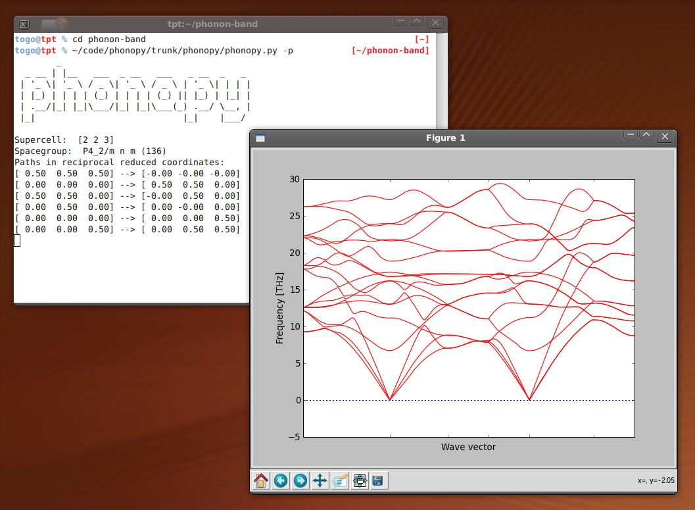

.. phonopy documentation master file, created by
   sphinx-quickstart on Mon Apr 13 15:11:21 2009.
   You can adapt this file completely to your liking, but it should at least
   contain the root `toctree` directive.

=======================================================
Welcome to phonopy
=======================================================

.. |i1| image:: pdos.png
        :width: 15%

.. |i2| image:: thermalprop.png
        :width: 15%

.. |i3| image:: QHA.png
        :width: 15%

**Phonopy** is an open source package for phonon calculations at
harmonic and quasi-harmonic levels.

**Phono3py** is another open source package for phonon-phonon interaction and lattice thermal
conductivity calculations. See the document at http://atztogo.github.io/phono3py/

**Phonon database**: A collection of first principles phonon
calculations is available as open data at
http://phonondb.mtl.kyoto-u.ac.jp/ , where the raw data of phonopy & VASP
results are downloaded.

Selected features
==================

- :ref:`Phonon band structure <band_structure_related_tags>`, :ref:`phonon DOS and partial-DOS <dos_related_tags>`
- :ref:`Phonon thermal properties <thermal_properties_tag>`: Free energy, heat capacity (Cv), and entropy
- :ref:`Phonon group velocity <group_velocity>`
- :ref:`Thermal ellipsoids <thermal_displacement_matrices_tag>` / :ref:`Mean square displacements <thermal_displacements_tag>`
- :ref:`Irreducible representations of normal modes <irreducible_representation_related_tags>`
- :ref:`Quasi-harmonic approximation <phonopy_qha>`: Thermal expansion, heat
  capacity at constant pressure (Cp),
- :ref:`Mode Grüneisen parameters <phonopy_gruneisen>`
- :ref:`Non-analytical-term correction <nac_tag>`: LO-TO splitting
  (:ref:`Born effective charges and dielectric constant are required. <born_file>`)
- :ref:`Interfaces to calculators <calculator_interfaces>`:
  :ref:`VASP <tutorial>`,
  :ref:`VASP DFPT <vasp_dfpt_interface>`,
  :ref:`Abinit <abinit_interface>`,
  :ref:`Pwscf <pwscf_interface>`,
  :ref:`Siesta <siesta_interface>`,
  :ref:`Elk <elk_interface>`,
  :ref:`FHI-aims <FHI_aims_interface>`,
  :ref:`Wien2k <wien2k_interface>`
- :ref:`Python APIs <phonopy_module>`
  
|i0| |i1| |i2| |i3|

Documentation
=============

.. toctree::
   :maxdepth: 1

   examples
   Tutorial <procedure>
   workflow
   install
   features
   input-files
   output-files
   setting-tags
   command-options
   qha
   Mode Grüneisen parameters <gruneisen>
   interfaces
   auxiliary-tools
   external-tools
   phonopy-module
   formulation
   citation
   reference
   changelog

.. _mailinglist:

Mailing list
============

For questions, bug reports, and comments, please visit following
mailing list:

https://lists.sourceforge.net/lists/listinfo/phonopy-users

Message body including attached files has to be smaller than 300 KB.

License
=======

New BSD from version 1.3.

(LGPL from ver. 0.9.3 to version 1.2.1., GPL to version 0.9.2.)

Contact
=======

* Author: `Atsushi Togo <http://atztogo.github.io/>`_

