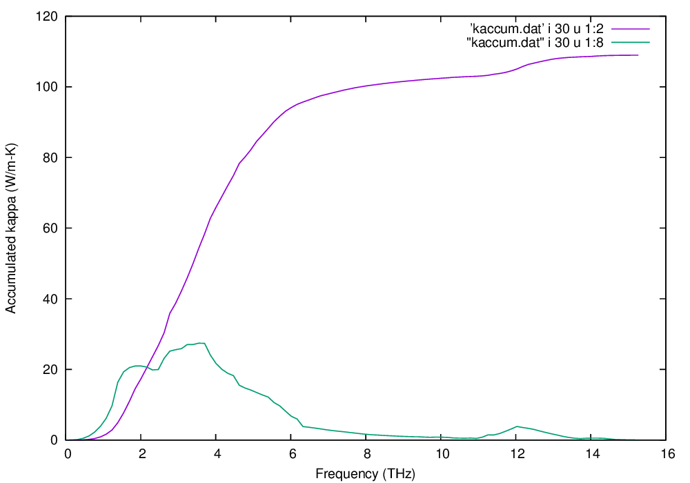

.. _auxiliary_tools:

Auxiliary tools
===============

``kaccum``
-----------

**This command is under the development. The usage and file format of
the output may change in the future.**

Accumulated lattice thermal conductivity with respect to frequency is
calculated. The frequency derivative like density of states is also
calculated.

::

   % kaccum --mesh="11 11 11" --pa="0 1/2 1/2 1/2 0 1/2 1/2 1/2 0" \
     POSCAR-unitcell kappa-m111111.hdf5 |tee kaccum.dat

``--mesh`` option is mandatory and ``--pa`` option is optional. The
first and second arguments are the unit cell and ``kappa-***.hdf5`` files,
respectively. 

The format of the output is as follows: The first column gives
frequency, and the second to seventh columns give the accumulated

lattice thermal conductivity of 6 elements, xx, yy, zz, yz, xz,
xy. The eighth to 13th columns give the derivatives. There are sets of
frequencies, which are separated by blank lines. Each set is for a
temperature. There are the groups corresponding to the number of
temperatures calculated.

To plot the output by gnuplot at temperature index 30 that may
correspond to 300 K,

::

   % echo 'p "kaccum.dat" i 30 u 1:2 w l, "kaccum.dat" i 30 u 1:8 w l'|gnuplot -persist

This is the result of silicon.

|i0|

``gaccum``
-----------

``gaccum`` is very similar to ``kaccum``, but for
:math:`\Gamma_\lambda(\omega_\lambda)`.

.. |sflogo| image:: http://sflogo.sourceforge.net/sflogo.php?group_id=161614&type=1
            :target: http://sourceforge.net

|sflogo|
