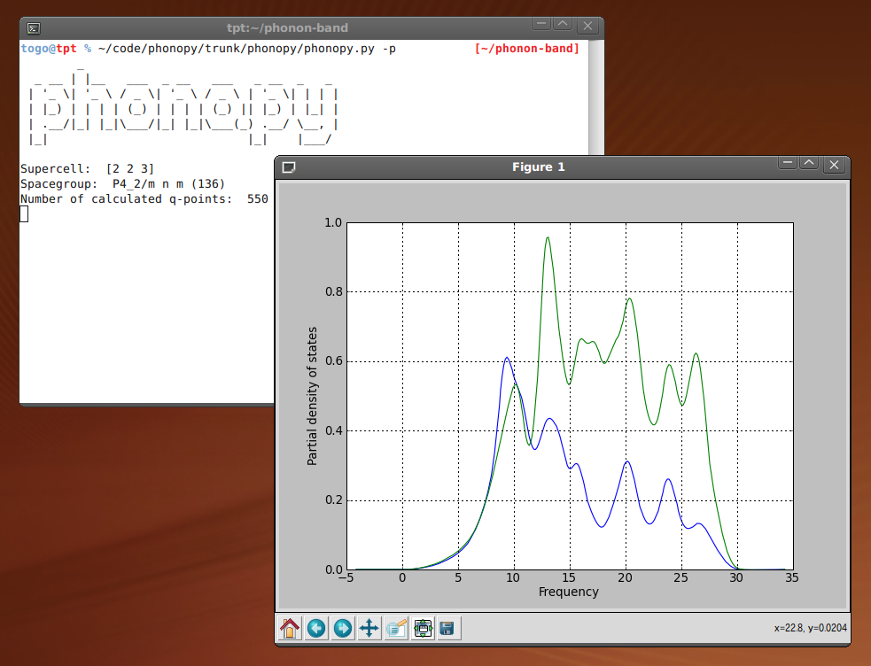
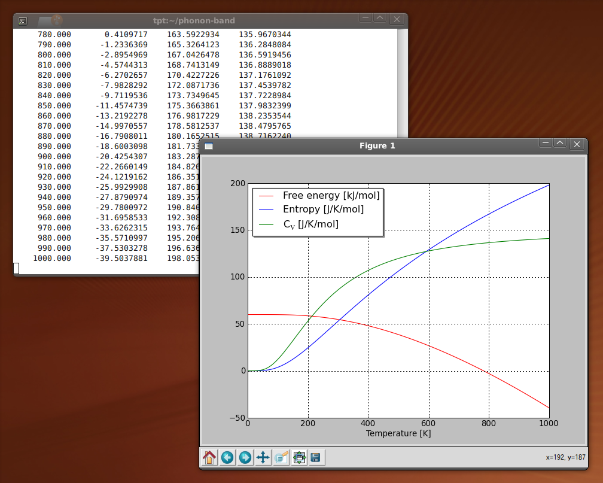
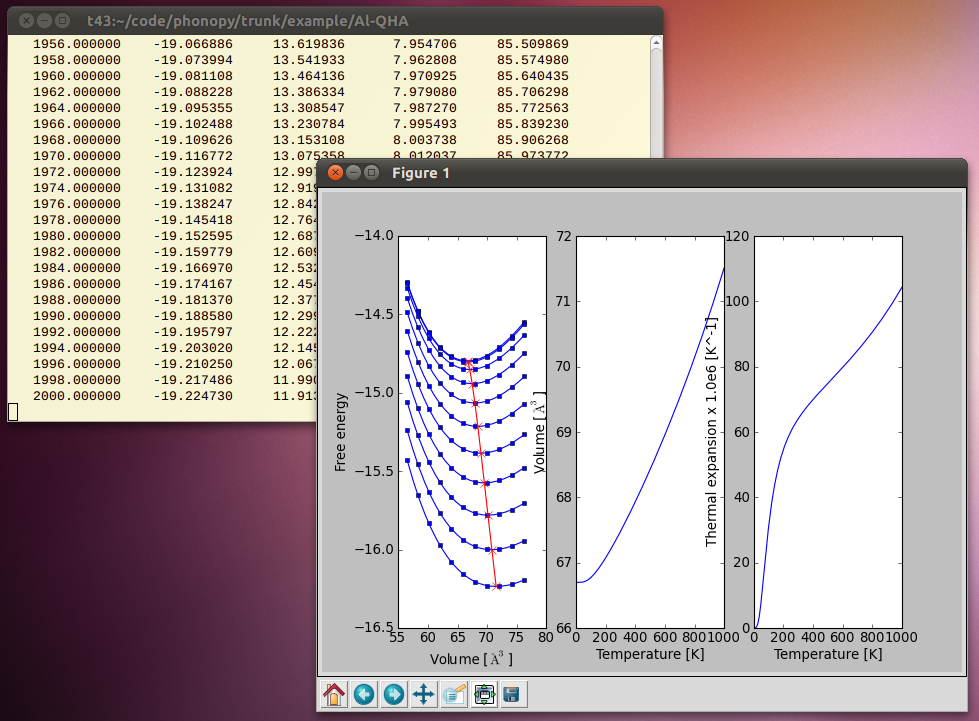

.. phonopy documentation master file, created by
   sphinx-quickstart on Mon Apr 13 15:11:21 2009.
   You can adapt this file completely to your liking, but it should at least
   contain the root `toctree` directive.

=======================================================
Welcome
=======================================================

.. |i0| image:: band.png
        :width: 15%

**Phonopy** is an open source package of phonon calculations based on the
supercell approach. 

On anharmonic phonopy
=======================

We are preparing to release a major update of phonopy with anharmonic
phonon calculations: phonon lifetime, lattice thermal conductivity,
etc. Currently the code is under the status of closed-beta. This is
for the test and optimization of the user interface with the help of
test users. Although we plan to release an open-beta with the manual
on the web soon, we are ready to distribute the beta-manual in pdf via
direct e-mail if we receive contacts from anybody who can be a test
user. Some more information on the closed-beta release and how to
contact is found at `this post
<http://sourceforge.net/p/phonopy/mailman/message/33211361/>`_ in the
phonopy mailing list.

Selected features
=======================

Selected features of harmonic and quasi-harmonic phonons are:

- Phonon dispersion relation (band structure)
- Phonon DOS and partial-DOS
- Phonon thermal properties, free energy, heat capacity (Cv), and entropy
- Phonon group velocity
- Thermal expansion and heat capacity at constant pressure (Cp) within
  quasi-harmonic approximation (:ref:`phonopy-qha <phonopy_qha>`)
- Mode Grüneisen parameters (:ref:`gruneisen <phonopy_gruneisen>`)
- Non-analytical-term correction, LO-TO splitting (Born effective
  charges and dielectric constant are required.)
- Creation of atomic modulations of normal modes
- Characters of irreducible representations of normal modes
- Crystal symmetry tools
- :ref:`Python module <phonopy_module>` (Phonopy can be used in python script.)
- Graphical plots
  
|i0| |i1| |i2| |i3|

Interfaces for calculators
===========================

- :ref:`VASP interface <tutorial>` (:ref:`finite displacement method <reference_plk>`)
- :ref:`Wien2k interface <wien2k_interface>` (:ref:`finite displacement method <reference_plk>`)
- :ref:`Abinit interface <abinit_interface>` (:ref:`finite displacement method <reference_plk>`) 
- :ref:`Pwscf interface <pwscf_interface>` (:ref:`finite displacement method <reference_plk>`) 
- :ref:`VASP DFPT interface <vasp_dfpt_interface>` (force constants)
- :ref:`FHI-aims interface <FHI_aims_interface>` (:ref:`finite displacement method <reference_plk>`)

For the other calculators, input files under certain formats
(:ref:`force sets <file_forces>` or :ref:`force constants
<file_force_constants>`) are required. But the interfaces for popular
calculators may be implemented if requested.

Documentation
=============

.. toctree::
   :maxdepth: 2

   contents

- `Manual in PDF <https://sourceforge.net/projects/phonopy/files/phonopy%20documentation/phonopy-manual.pdf/download>`_

- `Presentation: Introduction to phonopy <https://sourceforge.net/projects/phonopy/files/phonopy%20documentation/phonopy-workshop.pdf/download>`_

- `Presentation: Introduction to phonons <http://sourceforge.net/projects/phonopy/files/phonopy%20documentation/introduction-phonon-calc.pdf/download>`_

.. _mailinglist:

Mailing list
============

For questions, bug reports, and comments, please visit following
mailing list:

https://lists.sourceforge.net/lists/listinfo/phonopy-users

Message body including attached files has to be smaller than 300 KB.

License
=======

New BSD from version 1.3.

(LGPL from ver. 0.9.3 to version 1.2.1., GPL to version 0.9.2.)

Contact
=======

* Author: `Atsushi Togo <http://atztogo.users.sourceforge.net/>`_

|sflogo|

.. |sflogo| image:: http://sflogo.sourceforge.net/sflogo.php?group_id=161614&type=1
            :target: http://sourceforge.net

