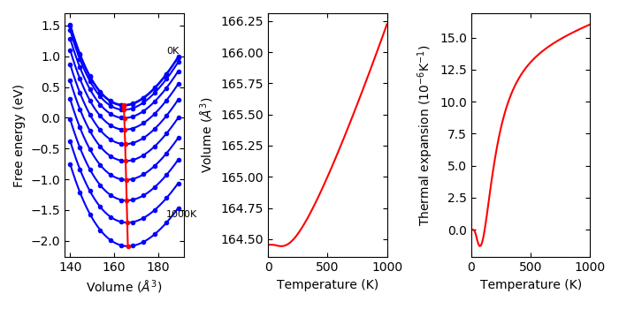

.. _phonopy_qha:

Quasi harmonic approximation
=============================================

.. contents::
   :depth: 2
   :local:

Usage of ``phonopy-qha``
------------------------

Using phonopy results of thermal properties, thermal expansion and
heat capacity at constant pressure can be calculated under the
quasi-harmonic approximation. ``phonopy-qha`` is the script to
calculate them. An example of the usage for ``example/Si-QHA`` is as
follows.

To watch selected plots::

   phonopy-qha --sparse=50 -p e-v.dat thermal_properties.yaml-{-{5..1},{0..5}}

Without plots::

   phonopy-qha e-v.dat thermal_properties.yaml-{-{5..1},{0..5}}

1st argument is the filename of volume-energy data (in the above
expample, ``e-v.dat``). The volume and energy of the unit cell
(default units are in :math:`\mathrm{\AA}^3` and eV, respectively). An
example of the volume-energy file is::

   #   cell volume   energy of cell other than phonon
        140.030000           -42.132246
        144.500000           -42.600974
        149.060000           -42.949142
        153.720000           -43.188162
        158.470000           -43.326751
        163.320000           -43.375124
        168.270000           -43.339884
        173.320000           -43.230619
        178.470000           -43.054343
        183.720000           -42.817825
        189.070000           -42.527932

Lines starting with ``#`` are ignored. The other arguments are the
filenames of ``thermal_properties.yaml`` calculated at the respective
volumes given in the 1st argument. The ``thermal_properties.yaml`` at
volume points have to be calculated with the same temperature ranges
and same temperature steps. ``thermal_properties.yaml`` can be
calculated by following :ref:`thermal_properties_tag`, where the
physical unit of the Helmholtz free energy is kJ/mol as the default,
i.e., no need to convert the physical unit in usual cases.

Another example for Aluminum is found in the ``example/Al-QHA`` directory.

If the condition under puressure is expected, :math:`PV` terms may be
included in the energies, or equivalent effect is applied using
``--pressure`` option.

.. _phonopy_qha_options:

Options
^^^^^^^

``-h`` 
~~~~~~~

Show help. The available options are shown. Without any option, the
results are saved into text files in simple data format.

``--tmax`` 
~~~~~~~~~~~~

The maximum temperature calculated is specified. This temperature has
to be lower than the maximum temperature calculated in
``thermal_properties.yaml`` to let at least two temperature points
fewer. The default value is ``--tmax=1000``.

``-p`` 
~~~~~~~

The fitting results, volume-temperature relation, and thermal expansion
coefficient are plotted on the display.

``--sparse`` 
~~~~~~~~~~~~~~

This is used with ``-s`` or ``-p`` to thin out the number of plots of
the fitting results at temperatures. When ``--sparse=10``, 1/10 is
only plotted.

``-s`` 
~~~~~~~

The calculated values are written into files.

``--pressure`` 
~~~~~~~~~~~~~~~~

Pressure is specified in GPa. This corresponds to the :math:`pV` term
described in the following section :ref:`theory_of_qha`. Note that
bulk modulus obtained with this option than 0 GPa is incorrect.

``-b`` 
~~~~~~~

Fitting volume-energy data to an EOS, and show bulk
modulus (without considering phonons). This is made by::

   phonopy-qha -b e-v.dat

``--eos``
~~~~~~~~~~~

EOS is chosen among ``vinet``, ``birch_murnaghan``, and
``murnaghan``. The default EOS is ``vinet``.

::

   phonopy-qha --eos='birch_murnaghan' -b e-v.dat

.. _phonopy_qha_output_files:

Output files
^^^^^^^^^^^^^

The physical units of V and T are :math:`\AA^3` and K,
respectively. The unit of eV for Helmholtz and Gibbs energies, J/K/mol
for :math:`C_V` and entropy, GPa for for bulk modulus and pressure
are used.

- Bulk modulus (GPa) vs T (``bulk_modulus-temperature.*``)
- Gibbs free energy (eV) vs T (``gibbs-temperature.*``) 
- Volume change with respect to the volume at 300 K vs T (``volume_expansion.*``)
- Heat capacity at constant pressure (J/K/mol) vs T derived by
  :math:`-T\frac{\partial^2 G}{\partial T^2}`  (``Cp-temperature.*``)
- Heat capacity at constant puressure (J/K/mol) vs T by polynomial
  fittings of Cv and S (``Cp-temperature_polyfit.*``)
- Helmholtz free energy (eV) vs volume
  (``helmholtz-volume.*``). When ``--pressure`` option is specified,
  energy offset of :math:`pV` is added. See also the following section
  (:ref:`theory_of_qha`).
- Volume vs T (``volume-temperature.*``)
- Thermal expansion coefficient vs T (``thermal_expansion.*``)
- Thermodynamics Grüneisen parameter (no unit) vs T (``gruneisen-temperature.dat``)

``Cv-volume.dat``, ``entropy-volume.dat``,
and ``dsdv-temperature.dat`` (:math:`dS/dV`) are the data internally
used.

.. _theory_of_qha:

Thermal properties in (*T*, *p*) space calculated under QHA
------------------------------------------------------------

Here the word 'quasi-harmonic approximation' is used for an
approximation that introduces volume dependence of phonon frequencies
as a part of anharmonic effect.

A part of temperature effect can be included into total energy of
electronic structure through phonon (Helmholtz) free energy at
constant volume. But what we want to know is thermal properties at
constant pressure. We need some transformation from function of *V* to
function of *p*. Gibbs free energy is defined at a constant pressure by
the transformation:

.. math::

    G(T, p) = \min_V \left[ U(V) + F_\mathrm{phonon}(T;\,V) + pV \right],

where

.. math::
   \min_V[ \text{function of } V ]

means to find unique minimum value in the brackets by changing
volume. Since volume dependencies of energies in electronic and phonon
structures are different, volume giving the minimum value of the
energy function in the square brackets shifts from the value
calculated only from electronic structure even at 0 K. By increasing
temperature, the volume dependence of phonon free energy changes, then
the equilibrium volume at temperatures changes. This is considered as
thermal expansion under this approximation.

``phonopy-qha`` collects the values at volumes and transforms into the
thermal properties at constant pressure.

