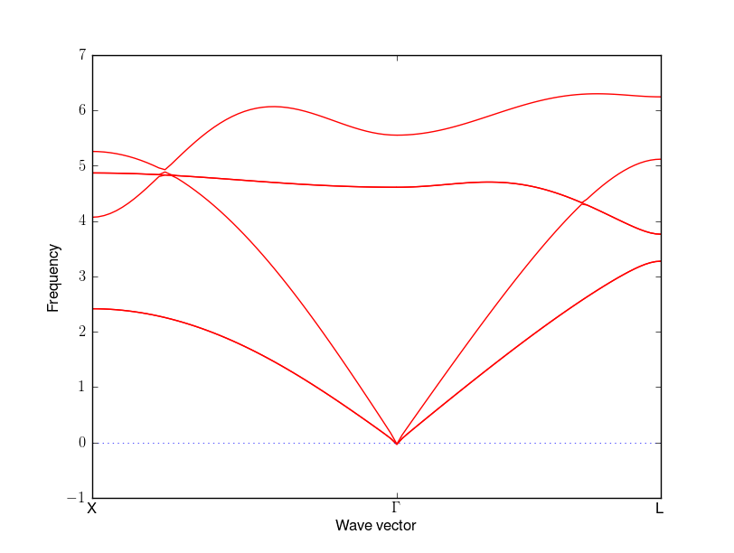
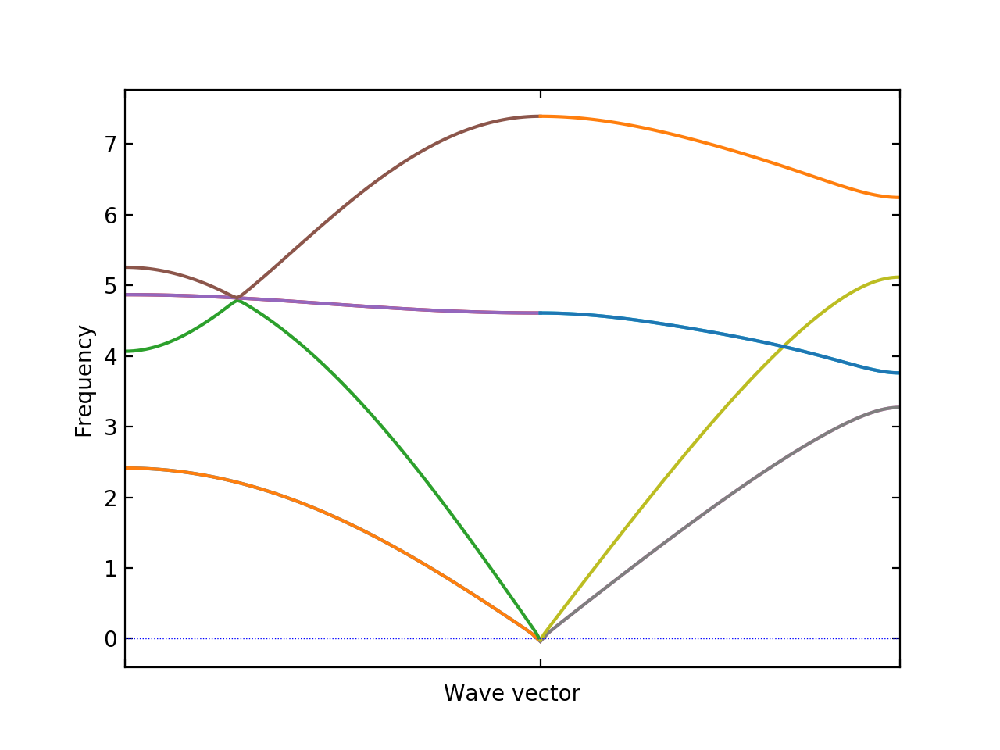

.. _setting_tags:

Setting tags
============

For specifying real and reciprocal points, fractional values
(e.g. ``1/3``) are accepted. However fractional values must not
have space among characters (e.g. ``1 / 3``) are not allowed.

Basic tags
----------

``ATOM_NAME``
~~~~~~~~~~~~~

Chemical symbols ::

   ATOM_NAME = Si O

The number of chemical symbols have to be same as that of the numbers
in the sixth line of ``POSCAR``.

Chemical symbols read by phonopy are overwritten by those written in
``POSCAR``. See ``POSCAR`` examples. In WIEN2k mode,
you don't need to set this tag, i.e., chemical symbols are read from
the structure file.

``EIGENVECTORS``
~~~~~~~~~~~~~~~~

When this tag is '.TRUE.', eigenvectors are calculated. With ``-p``
option, partial density of states are calculated.

.. _mass_tag:

``MASS``
~~~~~~~~

This tag is not necessary to use usually, because atomic masses are
automatically set from the chemical symbols.

Atomic masses of a primitive cell are overwritten by the values
specified. This tag does not affect to the symmetry findings. For
example, when there are six atoms in a primitive cell, ``MASS`` is set
as follows ::

   MASS =   28.085 28.085 16.000 16.000 16.000 16.000

.. _dimension_tag:

``DIM``
~~~~~~~~~~

The supercell is created from input unit cell. When three integers are
specified, supercell elongated along axes of unit cell is created.

::

   DIM = 2 2 3

In this case, 2x2x3 supercell is created.

When nine integers are specified, the supercell is created by
multiplying supercell matrix :math:`M_\mathrm{s}` with unit cell. For
example,

::

   DIM = 0 1 1  1 0 1  1 1 0

the supercell matrix is

.. math::

   M_\mathrm{s} = \begin{pmatrix}
   0 & 1 & 1 \\
   1 & 0 & 1 \\
   1 & 1 & 0 
   \end{pmatrix}

where the rows correspond to the first three, second three, and third
three sets of numbers, respectively. When lattice parameters of unit
cell are the column vectors of :math:`\mathbf{a}_\mathrm{u}`,
:math:`\mathbf{b}_\mathrm{u}`, and :math:`\mathbf{c}_\mathrm{u}`,
those of supercell, :math:`\mathbf{a}_\mathrm{s}`,
:math:`\mathbf{b}_\mathrm{s}`, :math:`\mathbf{c}_\mathrm{s}`, are
determined by,

.. math::

   ( \mathbf{a}_\mathrm{s} \; \mathbf{b}_\mathrm{s} \; \mathbf{c}_\mathrm{s} )
   =  ( \mathbf{a}_\mathrm{u} \; \mathbf{b}_\mathrm{u} \;
   \mathbf{c}_\mathrm{u} ) M_\mathrm{s} 

Be careful that the axes in ``POSCAR`` is defined by three row
vectors, i.e., :math:`( \mathbf{a}_\mathrm{u} \; \mathbf{b}_\mathrm{u}
\; \mathbf{c}_\mathrm{u} )^T`.

.. _primitive_axis_tag:

``PRIMITIVE_AXIS``
~~~~~~~~~~~~~~~~~~
::

   PRIMITIVE_AXIS = 0.0 0.5 0.5  0.5 0.0 0.5  0.5 0.5 0.0

Likewise,

::

   PRIMITIVE_AXIS = 0 1/2 1/2  1/2 0 1/2  1/2 1/2 0

The primitive cell for building dynamical matrix is created by
multiplying primitive-axis matrix :math:`M_\mathrm{p}`. Let the matrix
as,

.. math::

   M_\mathrm{p} = \begin{pmatrix}
   0.0 & 0.5 & 0.5 \\
   0.5 & 0.0 & 0.5 \\
   0.5 & 0.5 & 0.0
   \end{pmatrix}

where the rows correspond to the first three, second three, and
third three sets of numbers, respectively.

When lattice parameters of unit cell (set by ``POSCAR``) are the
column vectors of :math:`\mathbf{a}_\mathrm{u}`,
:math:`\mathbf{b}_\mathrm{u}`, and :math:`\mathbf{c}_\mathrm{u}`,
those of supercell, :math:`\mathbf{a}_\mathrm{p}`,
:math:`\mathbf{b}_\mathrm{p}`, :math:`\mathbf{c}_\mathrm{p}`, are
determined by,

.. math::

   ( \mathbf{a}_\mathrm{p} \; \mathbf{b}_\mathrm{p} \; \mathbf{c}_\mathrm{p} )
   =  ( \mathbf{a}_\mathrm{u} \; \mathbf{b}_\mathrm{u} \;
   \mathbf{c}_\mathrm{u} ) M_\mathrm{p} 

Be careful that the axes in ``POSCAR`` is defined by three row
vectors, i.e., :math:`( \mathbf{a}_\mathrm{u} \; \mathbf{b}_\mathrm{u}
\; \mathbf{c}_\mathrm{u} )^T`.

Displacement creation tags
--------------------------

``DIAG``
~~~~~~~~~

When this tag is set ``.FALSE.``, displacements in diagonal directions
are not searched, i.e. all the displacements are along the lattice
vectors. ``DIAG = .FALSE.`` is recommended if one of the lattice
parameter of your supercell is mush longer or much shorter than the
other lattice parameters.

``PM``
~~~~~~~

This tag specified how displacements are found. When ``PM = .FALSE.``,
least displacements that can calculate force constants are found. This
may cause less accurate result. When ``PM = .TRUE.``, all the
displacements that are opposite to the least displacements are found.
The default setting is ``PM = AUTO``. Plus-minus displacements are
considered with this tag. If the plus and minus displacements are
symmetrically equivalent, only the plus displacement is found. This
may be in between ``.FALSE.`` and ``.TRUE.``. You can check how it
works to see the file ``DISP`` where displacement directions on atoms
are written.

.. _band_structure_related_tags:

Band structure related tags
----------------------------

``BAND``, ``BAND_POINTS``
~~~~~~~~~~~~~~~~~~~~~~~~~~~~~~~

``BAND`` gives sampling band paths. The reciprocal points are
specified in reduced coordinates. The given points are connected for
defining band paths. When comma ``,`` is inserted between the points,
the paths are disconnected.

``BAND_POINTS`` gives the number of sampling points including the path
ends. The default value is ``BAND_POINTS = 51``.

An example of three paths, (0,0,0) to (1/2,0,1/2), (1/2,1/2,1) to
(0,0,0), and (0,0,0) to (1/2,1/2,1/2), with 101 sampling points of
each path are as follows:

::

   BAND = 0 0 0  1/2 0 1/2,  1/2 1/2 1  0 0 0   1/2 1/2 1/2
   BAND_POINTS = 101

.. _band_labels_tag:

``BAND_LABELS``
~~~~~~~~~~~~~~~~~~

Labels specified are depicted in band structure plot at the points of
band segments. The number of labels has to correspond to the
number of band paths specified by ``BAND`` plus one.

::

   BAND = 1/2 0 1/2   0 0 0   1/2 1/2 1/2
   BAND_LABELS = X \Gamma L

|bandlabels|

The colors of curves are automatically determined by matplotlib. The
same color in a band segment shows the same kind of band. Between
different band segments, the correspondence of colors doesn't mean
anything.

.. _band_connection_tag:

``BAND_CONNECTION``
~~~~~~~~~~~~~~~~~~~~

**Experimental**

With this option, band connections are estimated from eigenvectors and
band structure is drawn considering band crossings. In sensitive
cases, to obtain better band connections, it requires to increase
number of points calculated in band segments by the ``BAND_POINTS`` tag.

::

   BAND = 1/2 0 1/2   0 0 0   1/2 1/2 1/2
   BAND_POINTS = 101
   BAND_CONNECTION = .TRUE.

|bandconnection|

.. _dos_related_tags:

DOS related tags
----------------

.. _mp_tag:

``MP``
~~~~~~

``MP`` numbers give uniform meshes in each axis. As the default
behavior, the center of mesh is determined by the Monkhorst-Pack
scheme, i.e., for odd number, a point comes to the center, and for
even number, the center is shifted half in the distance between
neighboring mesh points.

Examples of an even mesh with :math:`\Gamma` center in two ways,

::

   MP = 8 8 8 
   GAMMA_CENTER = .TRUE.

::

   MP = 8 8 8 
   MP_SHIFT = 1/2 1/2 1/2

``MP_SHIFT``
~~~~~~~~~~~~~~~~~~

``MP_SHIFT`` gives the shifts in direction along the corresponding
reciprocal axes (:math:`a^*`, :math:`b^*`, :math:`c^*`). 0 or 1/2
(0.5) can be used as these values. 1/2 means the half mesh shift with
respect to neighboring grid points in each direction.

``GAMMA_CENTER``
~~~~~~~~~~~~~~~~~~

Instead of employing the Monkhorst-Pack scheme for the mesh sampling,
:math:`\Gamma` center mesh is used. The default value is ``.FALSE.``.

::

   GAMMA_CENTER = .TRUE.

   
``DOS_RANGE``
~~~~~~~~~~~~~
::

   DOS_RANGE = 0 40 0.1

Total and partial density of states are drawn with some
parameters. The example makes DOS be calculated from frequency=0 to 40
with 0.1 pitch.

``PDOS``
~~~~~~~~
::

   PDOS = 1 2, 3 4 5 6

By setting this tag, ``EIGENVECTORS = .TRUE.`` is automatically set.
``PDOS`` tag controls how elements of eigenvectors are added. Each value
gives the atom index in primitive cell. ``,`` separates the atom
sets. Therefore in the example, atom 1 and 2 are summarized as one
curve and atom 3, 4, 5, and, 6 are summarized as the other curve.

.. _sigma_tag:

``SIGMA``
~~~~~~~~~

This option specifies the deviation of a smearing function. The unit
is same as that of final result of DOS, i.e., for VASP without
``--factor`` option, it is THz. The default value is the value given
by the difference of maximum and minimum frequencies divided by 100.

::

   SIMGA = 0.1

.. _debye_model_tag:

``DEBYE_MODEL``
~~~~~~~~~~~~~~~~

By setting ``.TRUE.``, DOS at lower phonon frequencies are fit to a
Debye model. By default, the DOS from 0 to 1/4 of the maximum phonon
frequencies are used for the fitting. The function used to the fitting
is :math:`D(\omega)=a\omega^2` where :math:`a` is the parameter and
the Debye frequency is :math:`(9N/a)^{1/3}` where :math:`N` is the
number of atoms in unit cell. Users have to unserstand that this is
**not** a unique way to determine Debye frequency. Debye frequency is
dependent on how to parameterize it.

::

   DEBYE_MODEL = .TRUE.
   
.. _thermal_properties_tag:

Thermal properties related tags
--------------------------------

``TPROP``, ``TMIN``, ``TMAX``, ``TSTEP``
~~~~~~~~~~~~~~~~~~~~~~~~~~~~~~~~~~~~~~~~~

Thermal properties, free energy, heat capacity, and entropy, are
calculated from their statistical thermodynamic expressions
(see :ref:`thermal_properties_expressions`). Thermal properties are
calculated from phonon frequencies on a sampling mesh in the
reciprocal space. Therefore These tags are used with ``MP`` tag and
their convergence with respect to the sampling mesh has to be
checked. Usually this calculation is not computationally demanding, so
the convergence is easily achieved with increasing the density of the
sampling mesh. ``-p`` option can be used together to plot the thermal
propreties. Phonon frequencies have to be calculated in THz. Therefore
unit conversion factor to THz may be specified using ``--factor``
option. The calculated values are written into
``thermal_properties.yaml``. The unit systems of free energy, heat
capacity, and entropy are kJ/mol, J/K/mol, and J/K/mol, respectively,
where 1 mol means :math:`\mathrm{N_A}\times` your input unit cell (not
formula unit), i.e. you have to divide the value by number of formula
unit in your unit cell by yourself. For example, in MgO (conventional)
unit cell, if you want to compare with experimental results in kJ/mol,
you have to divide the phonopy output by four.

``TMIN``, ``TMAX``, and ``TSTEP`` tags are used to specify the
temperature range to be calculated. The default values of them are 0,
1000, and 10, respectively.

::

   TPROP = .TRUE.
   TMAX = 2000

.. _thermal_displacements_tag:

Thermal displacements
---------------------

**Experimental**

``TDISP``, ``TMAX``, ``TMIN``, ``TSTEP``
~~~~~~~~~~~~~~~~~~~~~~~~~~~~~~~~~~~~~~~~~~~~~~

Mean square displacements projected to Cartesian axes as a function of
temperature are calculated from the number of phonon excitations. The
usages of ``TMAX``, ``TMIN``, ``TSTEP`` tags (or ``--tmax``,
``--tmin``, ``--tstep`` options) are same as those in :ref:`thermal
properties tags <thermal_properties_tag>`. The result is writen
into ``thermal_displacements.yaml``. See the detail of the method,
:ref:`thermal_displacement`.

``PROJECTION_DIRECTION``
~~~~~~~~~~~~~~~~~~~~~~~~

Eigenvectors are projected along the direction specified by this tag.
Projection direction is specified in reduced coordinates, i.e., with
respect to *a*, *b*, *c* axes.

::

   TDISP = .TRUE.
   PROJECTION_DIRECTION = 1 1 0

Specific q-points
-----------------

.. _qpoints_tag:

``QPOINTS``
~~~~~~~~~~~

When ``QPOINTS = .TRUE.``, ``QPOINTS`` file in your working directory
is read, and the q-points written in this file are calculated.

Symmetry
---------

.. _fc_symmetry_tag:

``FC_SYMMETRY``
~~~~~~~~~~~~~~~~

This tag is used to symmetrize force cosntants partly. The number of
iteration of the following set of symmetrization applied to force
constants is specified. The default value is 0. In the case of VASP,
this tag is usually unnecessary to be specified.

::

   FC_SYMMETRY = 1

From the translation invariance condition,

.. math::

   \sum_i \Phi_{ij}^{\alpha\beta} = 0, \;\;\text{for all $j$, $\alpha$, $\beta$},

where *i* and *j* are the atom indices, and :math:`\alpha` and
:math:`\beta` are the Catesian indices for atoms *i* and *j*,
respectively. Force constants are symmetric in each pair as

.. math::

   \Phi_{ij}^{\alpha\beta}
        = \frac{\partial^2 U}{\partial u_i^\alpha \partial u_j^\beta} 
        = \frac{\partial^2 U}{\partial u_j^\beta \partial u_i^\alpha}
	= \Phi_{ji}^{\beta\alpha}

These symmetrizations break the symmetry conditions each other. Be
careful that the other symmetries of force constants, i.e., the
symmetry from crystal symmetry or rotational symmetry, are broken to
force applying ``FC_SYMMETRY``.

.. Tolerance of the crystal symmetry search is given by phonopy option of
.. ``--tolerance``.

.. ``TRANSLATION``
.. ~~~~~~~~~~~~~~~

.. Translational invariance is forced by setting ``TRANSLATION =
.. .TRUE.``. The default value is ``.FALSE.``. The input forces are
.. summed up in each Cartesian axis and the average are subtracted from
.. the forces.

.. ``PERMUTATION``
.. ~~~~~~~~~~~~~~~

.. Symmetry of force constants:

.. .. math::

..    \Phi_{ij}^{\alpha\beta}
..         = \frac{\partial^2 U}{\partial u_i^\alpha \partial u_j^\beta} 
..         = \frac{\partial^2 U}{\partial u_j^\beta \partial u_i^\alpha}
.. 	= \Phi_{ji}^{\beta\alpha}

.. is imposed with ``PERMUTATION = .TRUE.``. The default value is
.. ``.FALSE.``. This is not necessary to be set, because dynamical
.. matrix is always forced to be Hermitian in phonopy, i.e.,
.. :math:`D^{\alpha\beta}_{ij} = (D^{\beta\alpha}_{ji})^*`.

.. ``MP_REDUCE``
.. ~~~~~~~~~~~~~~

.. When mesh sampling, time reversal symmetry is imposed by setting
.. ``MP_REDUCE = .TRUE.``. The default value is ``.TRUE.``. If you don't
.. want time reversal symmetry, you have to set as ``MP_REDUCE =
.. .FALSE.``.

.. _force_constants_tag:

Force constants
---------------

``FORCE_CONSTANTS``
~~~~~~~~~~~~~~~~~~~

::

   FORCE_CONSTANTS = READ

There are three options, ``READ`` and ``WRITE``, and ``.FALSE.``. The
defualt is ``.FALSE.``. When ``FORCE_CONSTANTS = READ``, force
constants are read from ``FORCE_CONSTANTS`` file. With ``FORCE_CONSTANTS = WRITE``, force
constants calculated from ``FORCE_SETS`` are written to
``FORCE_CONSTANTS`` file.

The file format of ``FORCE_CONSTANTS`` is shown
:ref:`here <file_force_constants>`.

.. _animation_tag:

Create animation file
---------------------

``ANIME_TYPE``
~~~~~~~~~~~~~~~~

::

   ANIME_TYPE = JMOL

There are ``V_SIM``, ``ARC``, ``XYZ``, ``JMOL``, and ``POSCAR``
settings. Those may be viewed by ``v_sim``, ``gdis``, ``jmol``
(animation), ``jmol`` (vibration), respectively. For ``POSCAR``, a set
of ``POSCAR`` format structure files corresponding to respective
animation images are created such as ``APOSCAR-000``,
``APOSCAR-001``,.... 

There are several parameters to be set in the ``ANIME`` tag.

``ANIME``
~~~~~~~~~

**The format of ``ANIME`` tag was modified after ver. 0.9.3.3.**

For v_sim
^^^^^^^^^^

::

   ANIME = 0.5 0.5 0

The values mean a *q*-point to be calculated. An animation file of
``anime.ascii`` is generated.

.. toctree::

   animation

For the other animation formats
^^^^^^^^^^^^^^^^^^^^^^^^^^^^^^^^

Phonon is only calculated at :math:`\Gamma` point. So *q*-point is not
necessary to be set.

``anime.arc``, ``anime.xyz``, ``anime.xyz_jmol``, or ``APOSCAR-*``
are generated according to the ``ANIME_TYPE`` setting.

::

   ANIME = 4 5 20  0.5 0.5 0

The values are as follows from left:

1. Band index given by ascending order in phonon frequency.

2. Magnitude to be multiplied. In the harmonic phonon calculation,
   there is no amplitude information obtained directly. The relative
   amplitude among atoms in primitive cell can be obtained from
   eigenvectors with the constraint of the norm or the eigenvectors
   equals one, i.e., number of atoms in the primitive is large, the
   displacements become small. Therefore this has to be adjusted to
   make the animation good looking.

3. Number of images in one phonon period.

4. (4-6) Shift of atomic points in reduced coordinate in real space. These
   values can be omitted and the default values are ``0 0 0``.

For ``anime.xyz_jmol``, the first and third values are not used,
however dummy values, e.g. 0, are required.

.. _modulation_tag:

Create modulated structure
----------------------------

``MODULATION``
~~~~~~~~~~~~~~

The ``MODULATION`` tag is used to create a crystal structure with
displacements along normal modes at q-point in the specified supercell
dimension.

Atomic displacement of the *j*-th atom is created from the real part
of the eigenvectors with amplitudes and phase factors as

.. math::

   A\operatorname{Re}\left[\frac{\mathbf{e}_j\exp(i\phi)}{\sqrt{m_j}}\right],

where :math:`A` is the amplitude, :math:`\phi` is the phase, and
:math:`m_j` is the mass of *j*-th atom, and :math:`\mathbf{e}_j` is
the *j*-th part of eigenvector.

If several modes are specified as shown in the example above, they are
overlapped on the structure. The output filenames are
``MPOSCAR...``. Each modulated structure of a normal mode is written
in ``MPOSCAR-<number>`` where the numbers correspond to the order of
specified sets of modulations. ``MPOSCAR`` is the structure where all
the modulations are summed. ``MPOSCAR-orig`` is the structure without
containing modulation, but the dimension is the one that is specified.
Some information is written into ``modulation.yaml``.

Version 1.6
^^^^^^^^^^^^^

The first three values correspond to the supercell dimension.  The
following values are used to describe how the atoms are
modulated. Multiple sets of modulations can be specified by separating
by comma ``,``. In each set, the first three values give a Q-point in
the reduced coordinates in reciprocal space. Then the next three
values are the band index from the bottom with ascending order,
amplitude, and phase factor in degrees. The phase factor is
optional. If it is not specified, 0 is used.

Before multiplying user specified phase factor, the phase of
the modulation vector is adjusted as the largest absolute value,
:math:`\left|\mathbf{e}_j\exp(i\phi)/\sqrt{m_j}\right|`, of element of
3N dimensional modulation vector to be real. The complex modulation
vector is shown in ``modulation.yaml``.

::

   MODULATION = 3 3 1, 1/3 1/3 0 1 2, 1/3 1/3 2 3.5

::

   MODULATION = 3 3 1, 1/3 1/3 0 1 2, 1/3 0 0 2 2

::

   MODULATION = 3 3 1, 1/3 1/3 0 1 1 0, 1/3 1/3 0 1 1 90
   

Version < 1.6
^^^^^^^^^^^^^

The first three values correspond to a q-point in the reduced
coordinates in reciprocal space. The next three values give the
supercell dimensions that have to be specified by integers. The first
six values and the rest are sperated by comma ``,``.  The band
indices, amplitude, and phase factor to generate modulations are
specified by the following values as follows.

The value sets separated by comma ``,`` represent normal modes to be
modulated, i.e., several normal modes can be simultaneously specified.
In each set, three values can be specified. The first and second
values give the band index and amplitude, respectively. The third
value can optionally specified as the phase factor in degrees, where
the default value is 0.

::

   MODULATION = 1/3 1/3 0 3 3 1, 1 2, 2 3.5

Characters of irreducible representations of phonon modes
----------------------------------------------------------

.. _character_table_tag:

``CHARACTER_TABLE``
~~~~~~~~~~~~~~~~~~~~

Characters of irreducible representations (IRs) of phonon modes are
shown. The first three values gives a *q*-point in reduced coordinates
to be calculated. The unit cell has to be set as the primitive
cell. The degenerated modes are searched only by the closeness of
frequencies. The frequency difference to be tolerated is specified by
the fourth value in the frequency unit that the user specified.

Only the databases of IRs for a few point group types at the
:math:`\Gamma` point are implemented. If the database is available,
the symbols of the IRs and the rotation operations are shown.

::

   CHARACTER_TABLE = 0 0 0 1e-3

``IRREPS``
~~~~~~~~~~~

**Experimental**

Irreducible representations are shown along with character table.

::

   CHARACTER_TABLE = 1/3 1/3 0
   IRREPS = .TRUE.   

.. |sflogo| image:: http://sflogo.sourceforge.net/sflogo.php?group_id=161614&type=1
            :target: http://sourceforge.net

|sflogo|

