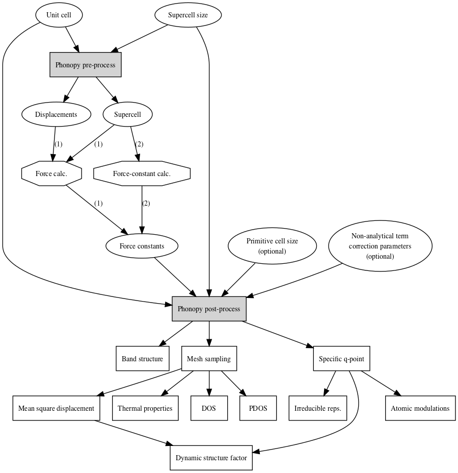

.. _workflow:

Work flow
--------------------

Work flow of phonopy is shown schematically. There are two ways to
calculate, (1) atomic forces from finite displacements and (2) given
force constants. You can choose one of them. Forces on atoms or force
constants are calculated by your favorite calculator (shown by the
diamonds in the work flow). The boxes are jobs being done by phonopy,
and the circles are input and intermediate output data structures.

   Work flow of phonon calculation

